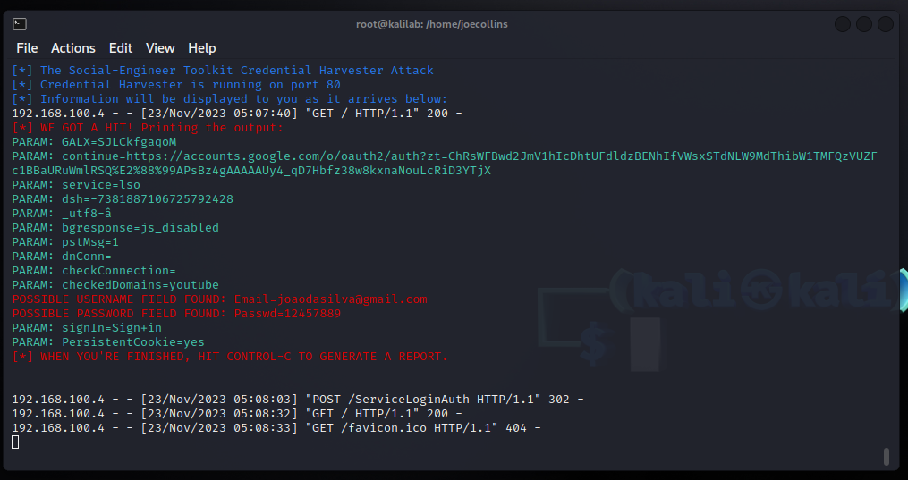

# Phishing para captura de senhas do Google

### Ferramentas

- Kali Linux
- setoolkit

### Configurando o Phishing no Kali Linux

- Acesso root: ``` sudo su ```
- Iniciando o setoolkit: ``` setoolkit ```
- Tipo de ataque: ``` Social-Engineering Attacks ```
- Vetor de ataque: ``` Web Site Attack Vectors ```
- Método de ataque: ```Credential Harvester Attack Method ```
- Método de ataque: ``` Web Templates ```
- Obtendo o endereço da máquina: ``` ifconfig ```
- Template: ``` Google ```

### Resutados



### Considerações

- Utilizando o método sugerido pelo desafio da DIO não foi possível obter sucesso. Na versão original do desafio, a sugestão era o Site Cloner junto ao facebook.
- É provável que foram feitas alterações substanciais no site do Facebook que impossibilitou a utilização da ferramenta apropriadamente.
